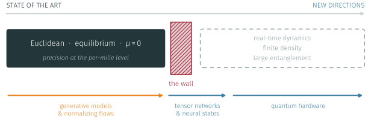
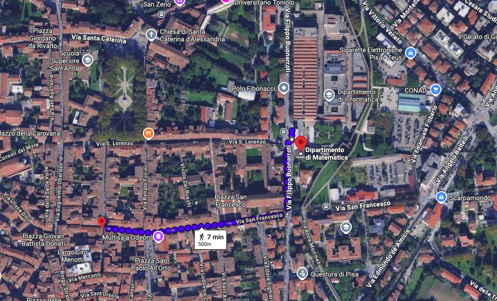
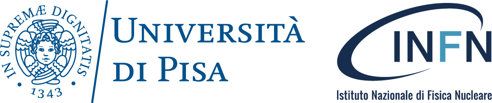

## Welcome {.center}

::: {.lead style="text-align:center; font-size:1.15em; margin-top:0.2em"}
Benvenuti a Pisa and welcome to the **first edition** of StaND4LQ.
:::

::: {.fragment style="margin-top:1.4em; border-left:5px solid #EB811B; background:rgba(235,129,27,0.07); border-radius:6px; padding:0.6em 1.3em"}
This workshop is organised **entirely by PhD students** of the University of Pisa.

::: {.note style="margin-top:0.4em"}
No senior committee and no registration fee.
:::
:::

::: {.fragment .lead style="text-align:center; margin-top:1.5em; font-size:0.95em"}
Three days, [**eighteen talks**]{.defect}, [**nine invited speakers**]{.easy}, and one
long discussion with no talks at all.
:::

## Where we are, and what stops us

::: {.note style="text-align:center; margin-top:-0.5em; font-size:0.85em"}
A precision science, which is exactly why we can see where it stops.
:::

{.reach-fig}

::: {.fragment style="margin-top:0.3em"}
::: {.eqbox style="display:block; text-align:center; font-size:0.8em"}
Not one of these four belongs to a single community,  
and that is the entire premise of this meeting.
:::
:::

## Five main areas {.money}

::: {.note style="text-align:center; margin-top:-0.7em; font-size:0.8em"}
Eighteen talks over three days.
:::



## Nine invited speakers

::: {.speakers}
::: {.sp}
[Claudio Bonanno]{.nm}   [University of Bern]{.af}
:::
::: {.sp}
[Pietro Butti]{.nm}   [University of Southern Denmark]{.af}
:::

::: {.sp}
[Bipasha Chakraborty]{.nm}   [University of Southampton]{.af}
:::
::: {.sp}
[Pierpaolo Fontana]{.nm}   [Universitat Autònoma de Barcelona]{.af}
:::
::: {.sp}
[Giuseppe Gagliardi]{.nm}   [INFN, Sezione di Roma Tre]{.af}
:::
::: {.sp}
[Alessandro Nada]{.nm}   [Università di Torino · INFN Torino]{.af}
:::
::: {.sp}
[Giulia Piccitto]{.nm}   [University of Catania]{.af}
:::
::: {.sp}
[Simone Romiti]{.nm}   [University of Bern]{.af}
:::
::: {.sp}
[Matteo Wauters]{.nm}   [University of Trento]{.af}
:::
:::

::: {.fragment .note style="text-align:center; margin-top:0.8em"}
Nine contributed talks from early-career researchers sit alongside them.
:::

## The session with no talks {.center}

::: {.lead style="text-align:center; margin-top:0.3em; font-size:1.25em"}
[**Thursday 1 October · 12:10 – 13:30**]{style="color:#EB811B"}
:::

::: {.fragment style="margin-top:1.2em; border-left:5px solid #3B7EA1; background:rgba(59,126,161,0.07); border-radius:6px; padding:0.7em 1.4em"}
An hour and twenty minutes with **no speaker and no slides**.

::: {.note style="margin-top:0.5em"}
It is the only part of the programme we cannot prepare for you.
:::
:::

::: {.fragment .lead style="text-align:center; margin-top:1.4em; font-size:0.88em"}
If you came here to find a collaborator rather than to give a talk,  
**this is the slot that matters**.
:::

## Practical information {.center}

:::: {.columns}
::: {.column width="52%"}

::: {.lead style="font-size:0.82em; line-height:1.7"}
**Venue**  
Polo Fibonacci, Building A  
Aula Magna, Dept. of Mathematics  
Largo Bruno Pontecorvo 3, Pisa

::: {style="margin-top:1.1em"}
**Coffee breaks** are offered by the organisation, just outside this room.
:::
:::

:::
::: {.column width="48%"}

::: {.lead style="font-size:0.82em; line-height:1.7"}
**Talk slots**  
Invited 50 minutes, contributed 30,  
questions included.

::: {style="margin-top:1.1em"}
**Anything at all**: find any of the four of us, or write to  
[stand4lq_workshop@lists.infn.it]{style="color:#3B7EA1"}
:::
:::

:::
::::

## Social dinner {.center}

:::: {.columns}
::: {.column width="31%"}

::: {style="border:3px dashed #EB811B; border-radius:10px; padding:0.7em 1em; background:rgba(235,129,27,0.09); text-align:center"}
Ristorante **La Grotta**

Thursday 1 October   [**20:00**]{style="font-size:1.15em"}
:::

::: {.fragment .lead style="text-align:center; margin-top:1.3em; font-size:0.8em"}
[**7 minutes on foot**]{style="color:#EB811B"} from this room,  
straight down Via San Francesco.
:::

:::
::: {.column width="69%"}

{.map-shot}

:::
::::

## With the support of {.center}

{.sponsor-logos}

::: {.fragment .lead style="text-align:center; margin-top:2.2em; font-size:0.92em"}
This workshop is funded by the **University of Pisa** and **INFN, Sezione di Pisa**.
:::

::: {.fragment .note style="text-align:center; margin-top:1.1em; font-size:0.85em"}
Coffee breaks for three days, and a first edition with no fee.
:::

## Thank you {.center}

::: {.thanks-card .defect-box}
[9]{.fig}

::: {.txt}
[invited speakers]{.who}
[for agreeing to come to a workshop that did not yet exist]{.sub}
:::
:::

::: {.fragment .thanks-card .easy-box}
[9]{.fig}

::: {.txt}
[contributed talks]{.who}
[from early-career researchers, standing alongside them by design]{.sub}
:::
:::

::: {.fragment .lead style="text-align:center; margin-top:1.7em; font-size:0.95em"}
And to all [**31**]{style="color:#EB811B"} of you who registered.
:::

# Enjoy the workshop! {.center}
